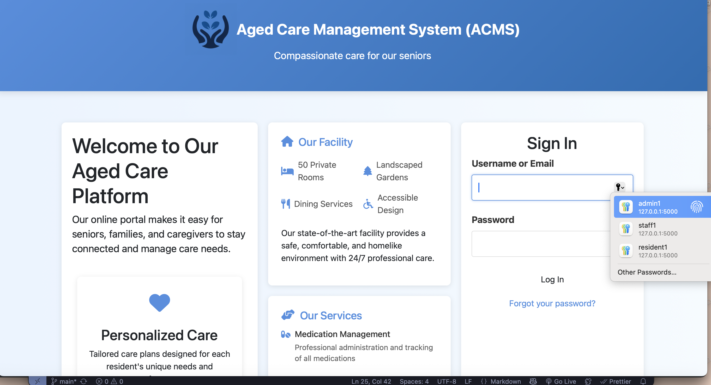

# Aged Care Management System

## Table of Contents
- [Introduction](#introduction)
- [Features](#features)
- [Technologies Used](#technologies-used)

## Introduction
The **Aged Care Management System (ACMS)** is a comprehensive web-based solution designed to streamline operations in aged care facilities. This full-stack application provides secure, role-based management of residents, staff, inventory, and family communications through an intuitive, responsive interface.

## Features
- Multi-role Authentication System (Admin, Staff, Resident/Family)
- Resident Management - Complete resident profiles, care plans, and medical history
- Staff management (roles, schedules, contact information)
- Inventory Management - Real-time stock tracking with expiry alerts
- Responsive Design - Mobile-friendly Bootstrap interface
- Secure authentication and role-based access control

## Technologies Used
- **Frontend**: HTML5, CSS3, JavaScript, Bootstrap
- **Backend**: Python, Flask, PyMySQL
- **Database**: MySQL 
- **Authentication**: Session-based with password hashing
- **Hosting**: Local Hosting with XAMPP
